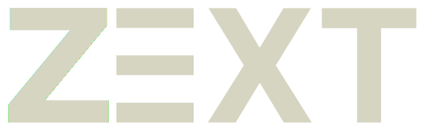

# ZEXT - Video Sharing Platform

    

        
    

## Instructions to run the application

1. Clone the repository

> git clone https://github.com/BernardoFMF/zext.git

2. Create a MongoDB database, and if you want to monitor the database on the desktop download MongoDB Compass

> https://www.mongodb.com/

3. All configurations regarding typescript and next are included, so run the following command on both the client and server directories

> npm install

4. Add the following environmnet variables to your workspace

> CORS_ORIGIN = http://localhost:3000
> PORT = 4000
> JWT_SECRET = *whatever secret you want*
> EXPIRES_IN = 7d
> DB_CONNECTION_STRING = *your mongoDB connection string*

5. On the client directory, create the following file

> .env.local

6. Add the following line to that file

> NEXT_PUBLIC_API_ENDPOINT=http://localhost:4000

7. Now you can run the application, for that open the command line on both the client and server directories and use the following command

> npm run dev